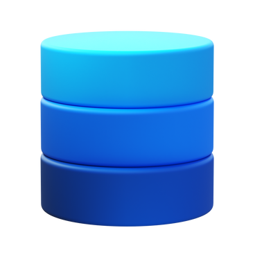

<!--
Copyright (c) 2023-2026 Robert A. Howell
Author: Robert A. Howell
Description: This project was created as a portfolio piece and demonstrates web application development deployed as https://www.rh-snapi-site.com/.
Created_Date: November 2023
Edited: 2026-06-29
Updated: 2026-05-21
-->

# SpaceFlight News App  
Spaceflight News App is a website created to showcase my developer skill sets. Details are written below about the project, from its creation.  

The live project operates at [https://spaceflight-web.rhdeveloping.com/](https://spaceflight-web.rhdeveloping.com/).  

## Dynamic view selection  
The architecture originated with Razor pages. Offering quick, flexible stand-up files, initiated in the project's beginnings, the decision to design and incorporate dynamic view attributes began with a single day's article view. The API was intelligently leveraged to implement historical navigation. An infinite history was found to be unreasonable on this site; to accomodate, the current 30 day (history) limit was introduced. Remaining dynamic components include:

* Navigation panel  
* Day display  
    * Previous day  
    * Previous week  
    * Oldest  
    * Next day  
    * Next week  
    * Newest (today)  
* View toggle  
    * Single-column  
    * Multi-column brick css, a.k.a. masonry style  
* Search feature (currently limited to news site names, available on the About page)  

## Looking further into the architecture  
Without any user involvement, this application collects and displays information automatically. New article sets are brought in every day alongside today's astronomy picture. SQL introduction started from early project stages and includes multiple tables storing the API's Article and APOD data.  

The API has been removed, as the below archive dictates. The site functionality has not changed after the removal. The backend data is now responsible to limit data availability to only web requests. Multiple features remain, from previous:

This is a blazor web application using:
1. ASP.NET, .NET Core
2. Components implementation using razor syntax
3. Razor pages
4. Relational SQL database using MySQL
5. Entity Framework Core
6. Server-side rendering
7. Bootstrap CSS
8. Solution developed in Visual Studio
9. IIS web server runtime
10. DNS via Cloudflare

.drawio.svg)

**Icon references provided below  

### URL Query Filters  
Designed to use in a browser window, the interface works for people in a reading context. Articles' data is manipulated through three view options: single-column, multi-column, or table. When these options are selected, the URL reflects the decision and organizes the data appropriately.  

**Below is an archive version of this repository**  

## 7-1-2024 Update  
This site is now live! This code repository serves to host the previous iteration of the site's live code. Today the code and code stack are very different and are not open source. The site, however, is available for public viewing and querying the database.  

## Features  
This is a blazor web application using:
1. Components implementation using razor syntax (C#, HTML, CSS, CSHTML)
2. Multi-project solution developed in Visual Studio
3. ASP.NET API endpoint:
 - Article fetch at /spaceflightAPI/articles
 - APOD fetch at /spaceflightAPI/apod
4. Bootstrap CSS
5. C# MVC
6. JSON file  (Backend)
7. API fetches of article data in JSON format (see Server/Services/JsonFileFetchService.cs) provide the content used in the web assembly page

## Database backend

> 
>
> Database illustration by <a href="https://icons8.com/illustrations/author/zD2oqC8lLBBA">Icons 8</a> from <a href="https://icons8.com/illustrations">Ouch!</a>
>
> 
>
> <a target="_blank" href="https://icons8.com/icon/13682/cloudflare">CloudFlare</a> icon by <a target="_blank" href="https://icons8.com">Icons8</a>
>
> 
>
> <a target="_blank" href="https://icons8.com/icon/13620/page">Article</a> icon by <a target="_blank" href="https://icons8.com">Icons8</a>
>
> 
>
> <a target="_blank" href="https://icons8.com/icon/13119/news">Article</a> icon by <a target="_blank" href="https://icons8.com">Icons8</a>
>
> Remaining icons from <a target="_blank" href="https://app.diagrams.net/">draw.io</a>  
> Diagram created at <a target="_blank" href="https://app.diagrams.net/">draw.io</a>  
